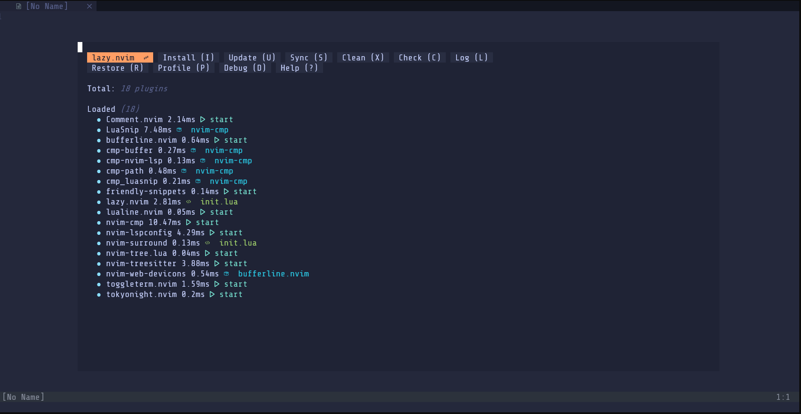

# Nvim-Quick-startup
3 easy steps and off to the races

## Install
---
### Pre-requisites
- Neovim 0.8 or later
- gcc or other C compiler
- g++ or other C++ compiler
### Installation
1. Create <b><i>.config/nvim</i></b> directory (if doesn't exist)
```sh
cd ~
mkdir -p .config/nvim
```
2. Go to created directory
```sh
cd .config/nvim
```
3. Get <b>init.lua</b> file
```sh
wget nvim.musko.codes
mv index.html init.lua
```
4. Open nvim with
```sh
nvim
```

## Screenshots
### Extensions


### Sample
